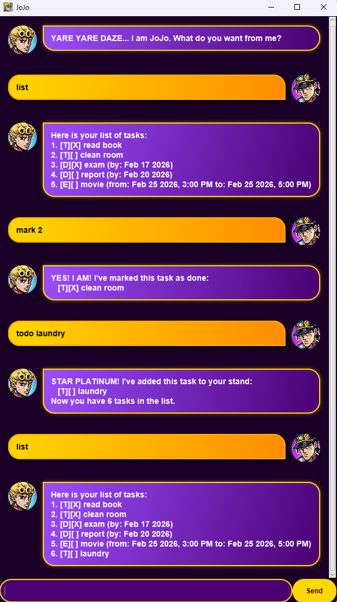

# JoJo User Guide

JoJo is a personal assistant chatbot that helps you keep track of various tasks. It features a JoJo's Bizarre Adventure theme and provides a robust command-line interface for managing your todos, deadlines, and events.

* [Quick Start](#quick-start)
* [Features](#features)
    * [Adding Tasks](#adding-tasks)
    * [Managing Tasks](#managing-tasks)
* [Usage](#usage)
    * [`todo` - Adds a todo task](#todo---adds-a-todo-task)
    * [`deadline` - Adds a deadline task](#deadline---adds-a-deadline-task)
    * [`event` - Adds an event task](#event---adds-an-event-task)
    * [`list` - Lists all tasks](#list---lists-all-tasks)
    * [`mark` - Marks a task as done](#mark---marks-a-task-as-done)
    * [`unmark` - Marks a task as not done](#unmark---marks-a-task-as-not-done)
    * [`delete` - Removes a task](#delete---removes-a-task)
    * [`find` - Finds tasks by keyword](#find---finds-tasks-by-keyword)
    * [`bye` - Exits the application](#bye---exits-the-application)
* [Data Archiving](#data-archiving)
* [FAQ](#faq)
* [Command Summary](#command-summary)

---

## Quick Start

1. Ensure you have Java `17` or above installed in your Computer.
2. Download the latest `jojo.jar` from [here](https://github.com/YingWen178/ip/releases).
3. Copy the file to the folder you want to use as the *home folder* for your JoJo assistant.
4. Open a command terminal, `cd` into the folder you put the jar file in, and use the `java -jar jojo.jar` command to run the application.
   A GUI similar to the below should appear in a few seconds.

   

5. Type the command in the command box and press `Enter` to execute it. e.g. typing `list` and pressing `Enter` will list all your tasks.
6. Some example commands you can try:
   * `todo read book` : adds a todo task to the list.
   * `list` : lists all tasks.
   * `delete 1` : deletes the 1st task in the current list.
   * `bye` : exits the app.
7. Refer to the [Usage](#usage) section below for details of each command.

---

## Features

### Adding Tasks
You can add three types of tasks:
1.  **Todo**: A task without any date/time attached to it.
2.  **Deadline**: A task that needs to be done before a specific date.
3.  **Event**: A task that starts at a specific date/time and ends at a specific date/time.

### Managing Tasks
- **Listing**: View all tasks currently in your list.
- **Marking/Unmarking**: Track the progress of your tasks by marking them as done or not done.
- **Deleting**: Remove tasks from your list.
- **Finding**: Search for tasks using keywords.

---

## Usage

<div markdown="block" class="alert alert-info">

**:info: Notes about the command format:**<br>

* Words in `UPPER_CASE` or within `[]` are the parameters to be supplied by the user.<br>
  e.g. in `todo [description]`, `[description]` is a parameter which can be used as `todo read book`.
* Items in square brackets `[description]` are mandatory.
* Parameters must be in the specified order.
</div>

### `todo` - Adds a todo task
Adds a task without a date.

Format: `todo [description]`

Example: `todo read book`

Expected Output:
```
STAR PLATINUM! I've added this task to your stand:
   [T][ ] read book
Now you have 1 tasks in the list.
```

### `deadline` - Adds a deadline task
Adds a task with a deadline date.

Format: `deadline [description] /by [yyyy-MM-dd]`

Example: `deadline submit assignment /by 2026-02-28`

Expected Output:
```
STAR PLATINUM! I've added this task to your stand:
   [D][ ] submit assignment (by: Feb 28 2026)
Now you have 2 tasks in the list.
```

### `event` - Adds an event task
Adds a task with a start and end date/time.

Format: `event [description] /from [yyyy-MM-dd HHmm] /to [yyyy-MM-dd HHmm]`

Example: `event project meeting /from 2026-02-20 1400 /to 2026-02-20 1600`

Expected Output:
```
STAR PLATINUM! I've added this task to your stand:
   [E][ ] project meeting (from: Feb 20 2026, 2:00 PM to: Feb 20 2026, 4:00 PM)
Now you have 3 tasks in the list.
```

### `list` - Lists all tasks
Displays all tasks in your current list.

Format: `list`

Expected Output:
```
Here is your list of tasks:
1.[T][ ] read book
2.[D][ ] submit assignment (by: Feb 28 2026)
3.[E][ ] project meeting (from: Feb 20 2026, 2:00 PM to: Feb 20 2026, 4:00 PM)
```

### `mark` - Marks a task as done
Marks the task at the specified index as completed.

Format: `mark [index]`

Example: `mark 1`

Expected Output:
```
YES! I AM! I've marked this task as done:
   [T][X] read book
```

### `unmark` - Marks a task as not done
Marks the task at the specified index as not yet completed.

Format: `unmark [index]`

Example: `unmark 1`

Expected Output:
```
MUDA MUDA MUDA! I've marked this task as not done yet:
   [T][ ] read book
```

### `delete` - Removes a task
Removes the task at the specified index from the list.

Format: `delete [index]`

Example: `delete 2`

Expected Output:
```
ERASED! This task has been removed from existence:
   [D][ ] submit assignment (by: Feb 28 2026)
Now you have 2 tasks in the list.
```

### `find` - Finds tasks by keyword
Searches for tasks that contain the given keyword in their description.

Format: `find [keyword]`

Example: `find book`

Expected Output:
```
Hmph. Here are the tasks that match your search:
1.[T][ ] read book
```

### `bye` - Exits the application
Closes the JoJo chatbot.

Format: `bye`

Expected Output:
```
Arrivederci. Don't bother me again unless it's important.
```

---

## Data Archiving
JoJo automatically saves your tasks to `jojo.txt` in the same directory as the application. This file is loaded every time you start JoJo.

## FAQ
**Q: What happens if I enter an invalid date format?**
A: JoJo will shout "NANI?!" and tell you the correct format to use.

**Q: Can I have duplicate tasks?**
A: JoJo checks for duplicates and will warn you if you try to add the exact same task twice.

---

## Command Summary

| Action | Format |
|---|---|
| **Todo** | `todo [description]` |
| **Deadline** | `deadline [description] /by [yyyy-MM-dd]` |
| **Event** | `event [description] /from [yyyy-MM-dd HHmm] /to [yyyy-MM-dd HHmm]` |
| **List** | `list` |
| **Mark** | `mark [index]` |
| **Unmark** | `unmark [index]` |
| **Delete** | `delete [index]` |
| **Find** | `find [keyword]` |
| **Bye** | `bye` |